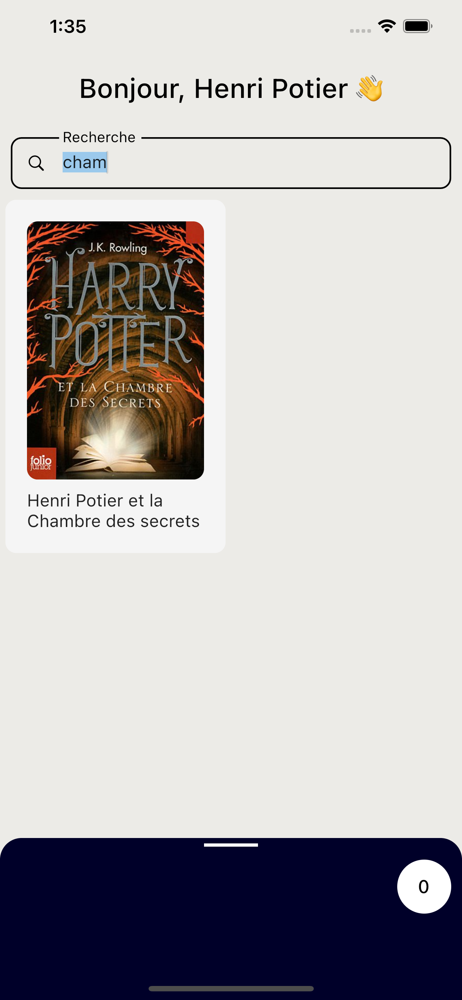

# Henri Potier

Test Mobile à compléter - DevoTeam

## Foncionnalités

* Visualiser la listes des livres
* Rechercher un livre
* Ajouter un livre au panier
* Supprimer du panier  
* Calculer la promotion la plus intéressante pour le client pour sa commande  
* Stockage interne avec Hive (Secure NoSQL Database)
* Images stockés dans la memoire cache

## Captures d'Écran

    
 


## Construire depuis la Source

1. Si vous n'avez pas le SDK Flutter installé, merci de visiter le site officiel de [Flutter](https://flutter.dev/).
2. Récupérez le code source de la branche master.

```
git clone https://github.com/racil12/henri_potier.git
```

3. Lancez l'application avec Android Studio ou VS Code. Ou dans la ligne de commandes:

```
flutter pub get
flutter run
```
